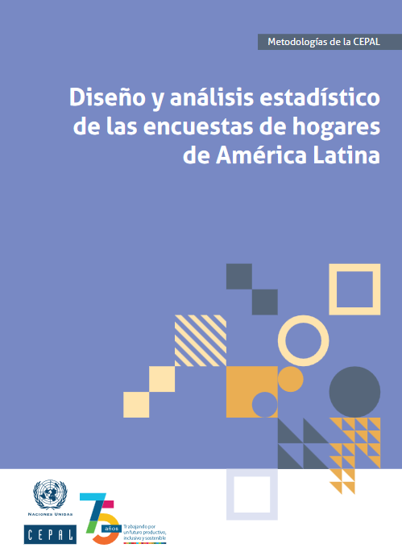
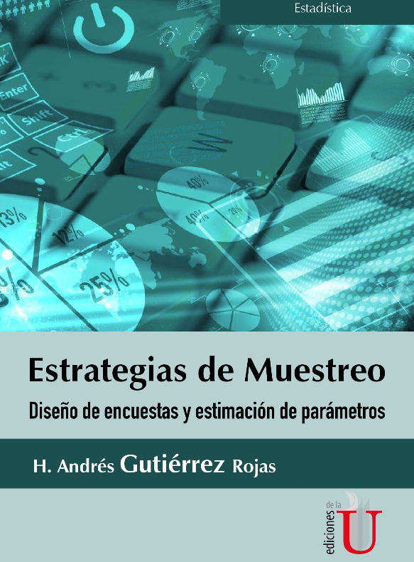

My books and teaching notes focus on survey sampling, household surveys, small area estimation, and the analysis of complex survey data. They are written for students, researchers, and practitioners who need to connect statistical theory with the practical decisions involved in designing, implementing, and analyzing surveys.

Several of these materials were created with reproducible workflows in mind. They combine methodological explanations, applied examples, and R code so readers can move from concepts to implementation without losing sight of the statistical assumptions behind each method.

### [Diseño y Análisis Estadístico de las Encuestas de Hogares en América Latina](https://www.cepal.org/es/publicaciones/68737-diseno-analisis-estadistico-encuestas-hogares-america-latina){target="_blank"}

::::: columns

::: {.column width="30%"}
{width="70%"}
:::

::: {.column width="60%"}
Written in Spanish, this book addresses the methodological and operational questions that arise in the design and analysis of household surveys in Latin America, including sampling frames, sample design, weighting, estimation, variance estimation, data quality, and the production of official statistics from complex survey data.
:::

:::::

### [Estrategias de Muestreo: Diseño de Encuestas y Estimación de Parámetros](https://psirusteam.github.io/EstrategiasDeMuestreo/){target="_blank"}

::::: columns

::: {.column width="30%"}
{width="70%"}
:::

::: {.column width="60%"}
Written in Spanish, this book provides a broad introduction to probability sampling, sample design, and parameter estimation, covering classical and modern strategies such as simple random sampling, stratified sampling, cluster sampling, multistage designs, unequal probability sampling, calibration, and model-assisted estimation, with applied examples in R.
:::

:::::

### [Survey Sampling](https://psirusteam.github.io/SurveySamplingBook/){target="_blank"}

This book is an introductory resource for learning the foundations of survey sampling and applying them with R, moving from basic ideas such as populations, samples, estimators, and sampling weights to reproducible examples that help readers compare designs, simulate finite populations, and understand how design choices affect precision and bias.

### [Household Surveys Analysis with R](https://psirusteam.github.io/HouseholdSurveysR/){target="_blank"}

This book focuses on the analysis of household survey data using R, with emphasis on sampling weights, stratification, clustering, domains of analysis, uncertainty estimation, and the production of reliable descriptive statistics, indicators, tables, and visual summaries from complex survey microdata.

### [Modelos Bayesianos con R y STAN](https://psirusteam.github.io/bookdownBayesiano/){target="_blank"}

This book introduces Bayesian modeling with R and Stan, combining statistical ideas with computational practice to help readers build, fit, check, and interpret probabilistic models involving prior distributions, likelihoods, posterior inference, hierarchical structures, simulation, and model diagnostics.
