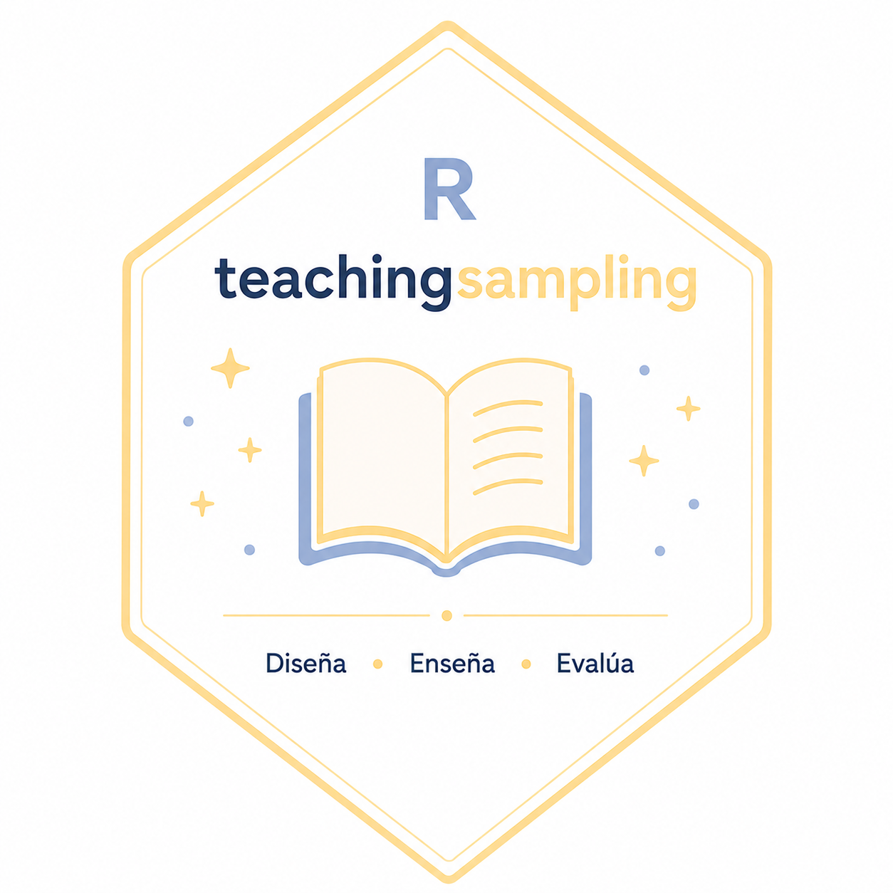
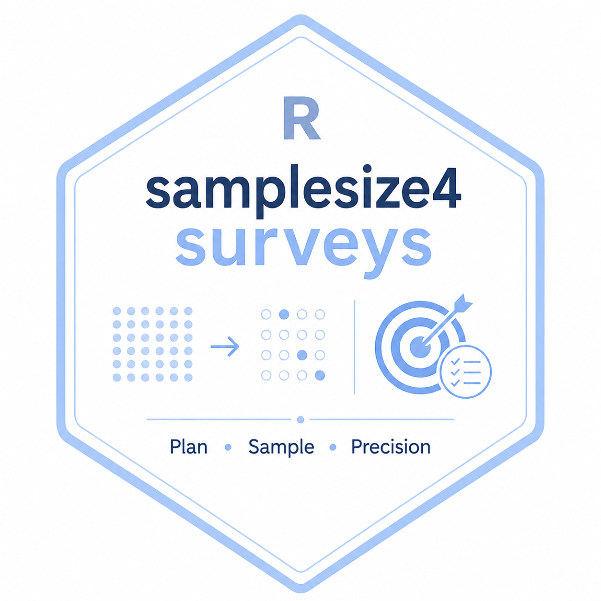
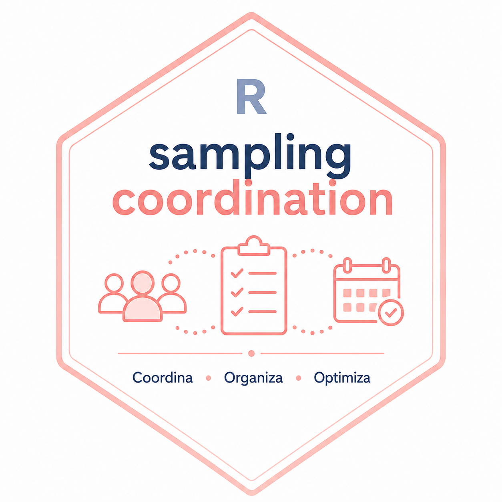

These software projects support the practical implementation of survey sampling methods, sample size planning, and coordination of complex survey designs. They are written mainly for R users who need transparent, reproducible tools for designing samples, evaluating precision, and carrying out survey operations in applied statistical work.

## [TeachingSampling](https://CRAN.R-project.org/package=TeachingSampling){target="_blank"}

::::: columns

::: {.column width="30%"}
{width="70%"}
:::

::: {.column width="60%"}
This R package provides tools for selecting probabilistic samples and making design-based inferences from finite populations. It is especially useful for teaching and applied work because it connects core sampling designs with practical estimation procedures, allowing users to draw samples, compute estimators, and understand how sampling decisions affect survey results.
:::

:::::

## [samplesize4surveys](https://cran.r-project.org/web/packages/samplesize4surveys/index.html){target="_blank"}

::::: columns

::: {.column width="30%"}
{width="70%"}
:::

::: {.column width="60%"}
This R package helps compute sample sizes for complex surveys under different inferential goals, including estimation of means, totals, proportions, variances, and regression-related quantities. It is designed for survey planners who need to account for finite populations, design effects, confidence levels, margins of error, statistical power, and other practical constraints before data collection begins.
:::

:::::

## [SamplingCoordination](https://github.com/psirusteam/SamplingCoordination){target="_blank"}

::::: columns

::: {.column width="30%"}
{width="70%"}
:::

::: {.column width="60%"}
This R package supports the coordination of samples in complex rotating survey designs. It includes tools related to rotating panels, overlap control, coordinated selection, and redistribution of primary sampling units, helping survey teams manage repeated samples over time while balancing renewal, continuity, and operational constraints.
:::

:::::

